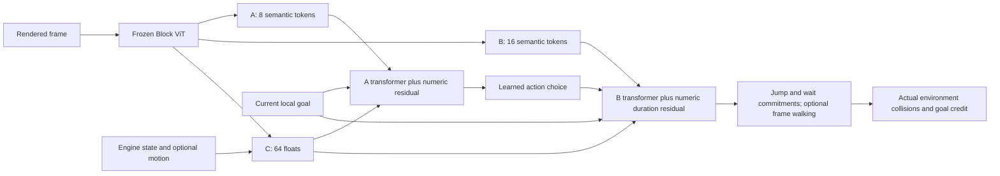

# Family learnability audit

The physics oracle proves a scenario is solvable. It does not prove that the
policy can learn it. This audit trains the real 128-dimensional hierarchical
model with the frozen Block ViT, then evaluates learned actions and durations
through the normal environment and primitive executor.

The family driver supports both on-policy learning and batched demonstration
learning. Current qualification experiments use demonstrations. They are evidence
of supervised learnability, not evidence that sparse-reward reinforcement learning
from random initialization is sufficient.

## Qualification

For each of the 21 families, train independently with seeds 101, 202, and 303.
A run needs at least 90% completion at **each** difficulty, twice consecutively
with additional training between evaluations. Only then evaluate an independent
30-layout test set (10 easy, 10 medium, 10 hard), again requiring at least 90% at
each difficulty. Training and evaluation have separate deterministic splits and
seeds. Evaluation removes family-provided A actions and never supplies oracle
sequences. These are observed pass rates; the small test sets do not establish
a 90% lower statistical confidence bound.

The shared-model driver then tests whether one policy can retain all families
under mixed training. Isolated successes cannot substitute for shared-policy
retention. `block_smb_learning_report` treats missing seeds, missing independent
tests, and missing shared-policy evidence as incomplete. Do not restart the full
volume run on a passing physics preflight alone.

## Failures found during actual learning

- Walk and wait demonstrations now label actual primitive starts, keep their
  total commitment duration constant through the span, and predict its final
  state. Treating every held frame as a fresh action decision and labeling a
  shrinking remaining duration conflicted with the executor's adaptive timing.
- Rare decisions were drowned out by frames that merely continued a held button.
  Sampling now balances actual takeoff/walk/wait decisions within each family;
  committed flight frames receive only a small share of the batch. Forced
  continuations do not receive policy-gradient credit.
- The original duration path often collapsed distinct geometries to one hold
  length. Zero-initialized numeric residual heads give actions and durations
  direct access to continuous C state and the requested goal. Existing weights
  retain their original outputs until these heads learn. The learning-rate
  override is recorded in training configuration.
- Platform-hop previously credited touching the goal while airborne, although
  its objective claimed to require landing. The revised family requires support
  on the target platform and evaluates a single attempt. Its oracle and duration
  labels now agree on the same completed landing.
- One exact scripted duration is not the only valid answer. Jump supervision
  uses the set of holds verified by replaying the actual collision physics from
  the initiation state. Mandatory stomps require stomp credit, not merely
  passing the enemy alive.
- Demonstration goals originally changed in mid-flight while the live collector
  kept the takeoff goal. Both now preserve the committed goal. Stomp bounces
  clear it and receive no actor credit. Neutral requests have the same encoding
  in training and evaluation. Bridge exits also keep the exit goal latched;
  previously up to 27 exit frames in a checked demonstration reverted to a wait
  request that the live controller never received.
- A single canonical route leaves landing and recovery states uncovered.
  Additional successful routes and fresh training layouts broaden coverage.
  Alternative routes preserve the immediate-jump contract of single-jump tasks.
  Only routes that physically complete the requested goal enter the dataset.
- Enemy distance alone is a weak input for moving interception. Optional motion
  observations add enemy velocity, patrol limits, vertical displacement, and
  moving-platform position, velocity, and limits. They are measurements from the
  environment, not oracle actions or success labels. Legacy observations retain
  their original 27 state slots; checkpoints with the extended layout are
  explicitly distinguished when restoring production training.
- Batched independent frames cannot train recurrent world-state feedback.
  Demonstration qualification disables that feedback rather than evaluating
  an untrained recurrent path. This is recorded as an ablation in checkpoints.

Not every failed short experiment establishes an architectural impossibility.
For example, patrol probes found different required holds for opposite enemy
motions, but the rendered eyes can reveal facing direction. This supports a
weak-observation diagnosis, not a proof that the raw pixels are unobservable.

## Production integration

`BlockSMBTrainingConfig` has optional demonstration bootstrap and rehearsal
updates. The same collector, balanced sampler, losses, and numeric learning-rate
helper are used by qualification and production. Rehearsal is logged separately
from real policy episodes. Frozen vision can encode the recorded demonstration
frames in batches; the resulting inputs and labels were checked against single
frame encoding. Actual evaluation remains sequential environment interaction.

The full-volume recipe remains stopped while the audit is incomplete. Enabling
these options alone is not a qualification result. Rates and source result paths
are in `block-smb-learning-audit.md` and its JSON companion.

The later enemy-stomp trace exposed a coverage gap: a learned approach reached a later takeoff than the canonical script, where only holds 1–4 could stomp, but selected an eight-frame hold. Both adaptive and fixed-commitment replays failed. Alternate successful trajectories now randomize takeoff distance as well as safe hold choice; refreshed and additional training layouts preserve that augmentation. Its qualification results are recorded in the learning matrix.

## Further decision-contract repairs

The larger tests exposed narrow failures hidden by the initial validation set.
Walks can now be reconsidered each frame while jump and wait primitives retain
commitments. Fixed-duration demonstration training supervises durations only
where the executor consumes them. A feedforward policy cannot recover a past
chosen duration from a continuation frame that omits commitment history.

Successful route variants can choose different actions from an identical
observed state. The actor objective now accepts their union. Optional priority
sampling focuses difficult states while preserving each family/action group's
sampling mass. This addresses rare initial walking states that otherwise lose
to heavily weighted jump examples. Supervised transformer execution now matches
greedy evaluation (soft context and no dropout); recurrent modules remain in
training mode for cuDNN backward. Qualification must still measure completion.

Duration supervision also favors interiors of contiguous safe hold ranges.
Two hard single-gap failures selected eight frames when their actual takeoff
required at least nine. Merely placing probability somewhere in a safe training
set did not encourage a margin on a nearby layout.

A raised pipe over continuous lower floor was incorrectly described as a gap
to the next pipe. The local objective now distinguishes that descent from a
pit. This repairs misleading goals in compound sections without changing their
physical success conditions. Bridge opening waits also remain in the waiting
phase when a short timer expires before the boarding window arrives; only a
physical readiness event or actual departure ends that opening phase.

These repairs have separate tests and learning experiments. See the generated
matrix for completed results; this document does not declare pending runs passed.

## Execution being qualified

The world model is still trained to predict primitive outcomes. Greedy
qualification does not let critic feedback replace the selected action, and
demonstration training disables carried recurrent feedback. Local goals and
support/event observations remain part of the controller. This is neither
pixels-only control nor oracle-driven evaluation.

The patrol audit found another local/global mismatch: clearing the first enemy
could leave an immediately trapped landing near the second. Jump labels now
follow nonterminal stomp bounces through landing and reject a nearby next-enemy
state with no viable jump. This is bounded recovery checking, not a proof of an
entire future route. The shared driver can increase practice for failing
families while keeping every other family represented, then reduces that extra
practice gradually after sustained passing validations. Both weights and outcomes are recorded.

`block_smb_recheck_learning` replays accepted checkpoints with the current
runtime. These default to the original test seed and are compatibility checks,
not fresh holdouts. The report incorporates matching rechecks so an old pass
cannot conceal a regression in the current environment or controller.

The current-code recheck invalidated three older seed-303 compound policies
(`mixed_section`, `full_smb_opening_proxy`, and `chained_obstacles`) after the
pipe-descent goal correction. Their old test scores are not interchangeable
with the corrected runtime. Replacement policies must complete the qualification gate; an older passing
score cannot override these observed regressions. Legacy checkpoints
must be rechecked when changing the goal/controller contract; matching tensor
shapes alone does not establish behavioral compatibility.

Production mastery now requires the gate at every difficulty, not only the
family average. Its full-practice grace precedes a gradual reduction, and the
same mastery weights feed optional demonstration rehearsal as well as live
scenario sampling. The production unit test exercises bootstrap, live updates,
and this weighted rehearsal path together.

## Completed qualification — September 6, 2026

All 21 families pass the isolated gate for seeds 101, 202, and 303. Each accepted
policy passed successive validations with further training between them, then
at least 9/10 cases at each difficulty on its test split. Follow-up training for
two seed-202 policies retains their original seed lineage. Different families
use different recipes, as recorded in the JSON report.

The final shared policy is warm-started from earlier shared-policy training.
It passed 630/630 validation cases twice with another 1,000 mixed demonstration
updates between validations. It then passed 627/630 test cases (seed 817219) and
627/630 additional frozen-policy holdout cases (seed 937661). Every family met
90% at every difficulty on both tests. Neither test updated the model. The
report verifies that the additional holdout used the same checkpoint hash.

The compatibility recheck exercised 61 previously accepted policies against the
current runtime. Three older seed-303 compound policies failed and were replaced
by freshly qualified policies; all accepted final policies were tested with the
corrected runtime. These compatibility replays reused the original test seed.

Validation also includes 292 passing regression tests, Ruff, and Black checks.
The local shared checkpoint is
`artifacts/block_smb/joint_learning_20260906_retention_grace/policy.pth`.
Large training artifacts remain local; compact test outcomes and configurations
are included in the versioned learning report.

Full-volume training remains stopped. This establishes demonstration-assisted
learnability on the Block SMB family generator with its normal goal, support,
and event inputs. It does not establish pure RL learning from scratch, a
statistical lower confidence bound, or transfer to the actual SMB game. The
older full-volume recipe has not been promoted as a newly qualified fresh-run
recipe; production bootstrap/rehearsal support is available and tested.
