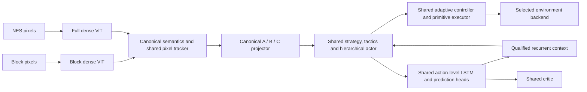

# Composable SMB implementation and restart

Implementation date: 2026-09-08. Design: [composable SMB transfer plan](composable-smb-transfer-plan.md).

## Architecture and interfaces

The implementations of the hierarchy, LSTM, critic, adaptive controller and
executor are shared. The dense ViTs have separate weights. Domain-specific ViT
embeddings never enter C: semantic probabilities supply deterministic spatial
features. A/B/C retain lengths 8/16/64; C contains position, canonical semantics,
support, 35 ordered physical features, eight availability indicators and nine
fixed spatial features. Coordinates use a 256×240 viewport and common velocity
scales. The same local objective replaces simulator finish-marker distances.
Synthetic finish rectangles are hidden from canonical Block observations. A
leftward navigation request is an explicit task input for `retreat_recovery`.

`retroagi/core/smb_components.py` saves actor, world model, critic, executor and
auxiliary state separately, packages perception separately, and records semantic,
physical, feature-order and runtime contracts. Loads check contracts, architecture,
tensor layouts and checksums. Replacing a component invalidates gameplay
qualification. Parameter digests verify frozen components during adaptation.
The adaptive controller has no separate learned matrices; its learned parameter
producer belongs to the actor component. Callers must discard carried LSTM memory
when replacing components; assembling a bundle starts a fresh model.

`load_bundle()` accepts a compatible replacement perception checkpoint. The Full
policy loader also accepts a bundle directory containing a perceived runtime and
canonical ViT. Oracle bundles are diagnostic artifacts, not pixel-player bundles.

## Physics, observations and labels

`nes_land_v1` ports fixed-point acceleration, run/walk limits, braking, air
steering, variable jump forces and button edges. Jump and wait bins represent
physical frames: `1,2,4,6,8,10,12,14,16,18,20,22,24,26,28,32`. The new wait contract
supports a one-frame wait. Running holds B for right/right-jump in both engines.
The historical physics/profile and duration meanings remain available for
reproducing old checkpoints; they are not relabeled as compatible.

The new player body is 10×12. The Goomba damage body is 10×6, with a distinct floor
probe four pixels below it. Goomba/Koopa bounce speed is −4 pixels/frame. Landing
clears fractional vertical force. Simulator snapshots include the complete
fixed-point motion state. Pixel and NES geometry histories are included in
emulator snapshots; restoring an encoded frame does not advance tracking again.
The NES geometry observer handles the Goomba flattened state (`4`) as well as
falling defeated states, and emits a stomp event once per transition.

Two observation lanes remain explicit: collision instrumentation for labels and
diagnostics, and dense ViT plus a shared temporal tracker for pixel playback.
The tracker estimates camera motion and object velocity, marks unavailable motion
and patrol bounds in model inputs, and preserves a takeoff objective in world
coordinates. Emulator capture crops are padded back into physical coordinates,
not stretched. Pixel encoding has a regression test that fails on any RAM read.

The recovered six-class CNN is loaded offline by a maintained wrapper. Its
checkpoint is still `scripts/segmentation/MarioSegmentationModel.pth`. Its output
vocabulary lacks coin, goal and moving-platform classes. The real-clip preflight
measured collision IoU of approximately 0.331 for Mario, 0.934 for terrain and
0.186 for enemies; the body-edge test also failed. No CNN class was approved by
that audit. This measures agreement with collision labels, not human-annotated
sprite outlines. CNN proposals are therefore not silently accepted as truth.

Dense perception training uses separately recorded collision masks and rendered
pixels, with clip provenance and held-out splits. Full perception splits by
approach identity, avoiding adjacent-frame train/validation leakage. Perception
promotion requires per-class overlap, body-edge and missed-body gates; background
pixel accuracy is insufficient.

## Fresh training sequence

Entrypoint: `python -m scripts.smb_composable_training --config
scripts/configs/smb_composable_full_volume.json --output-dir <fresh-directory>`.
The configuration rejects resume/init checkpoints and fixed scenes, and requires
30 shared-policy epochs and all 21 generated families.

1. Recheck the paired motion traces. Generate fresh Block perception clips and
   train a fresh dense ViT. Stop if collision-perception validation fails.
2. Initialize a separate fresh core for each family, collect successful routes
   through the actual playback executor, and test disjoint validation/test layouts.
   Require two successive validation passes and a held-out test pass. The gate is
   99% per difficulty; with ten cases per difficulty this requires ten successes.
3. After every family passes, initialize the shared core again. Use 180 initial
   layouts per family, 10,000 bootstrap updates, then 30 epochs with 525 new
   generated layouts and 1,000 rehearsal updates per epoch. Validation and test
   each contain 630 layouts. There are no fixed-scene training/evaluation entries.
4. Train ordered Block sequences with carried recurrent context and explicit
   episode resets. This is one-frame truncated BPTT at playback cadence. Verify
   that changing LSTM weights can change actor logits, and recheck family retention.
   Keep the reset-memory baseline if the recurrent candidate fails qualification.
5. Capture individual NES approaches and physical timing variations. Record
   snapshot, target, actions, physics fingerprint, collision labels and provenance.
   Deduplicate physical starts across splits. Save unresolved starts for repair.
   Teacher routes must reach stable support beyond the obstacle; deployed playback
   never searches snapshots or calls a teacher.
6. Qualify the Full ViT. Train independent scratch controls for each approach,
   collect corrections on policy-visited training states, and test held-out nearby
   variations. The production schedule requests 18 training and 100 validation /
   100 test timing settings, subject to physical deduplication and reachability.
   At least 100 held-out evaluations and 99% success are required for a local gate.
7. Compare oracle/frozen core, Full ViT/frozen core, and Full ViT/adapted world model.
   World-model adaptation includes Block replay, frozen actor/critic hash checks
   and a Block retention evaluation. Save adapted components separately. Do not
   claim LSTM adaptation improves decisions if the recurrent path was not qualified.
8. Only after local gates pass, test longer uninterrupted playback and the named
   full-level starts, with actual completion and death signals. Local results never
   become a full-level qualification by themselves.

`manifest.json` records configuration and source hashes. `events.jsonl` and
`status.json` expose the active phase; a failed gate writes its reason and stops.
Epoch bundles and validation reports are separate. The intended fresh launch root
is `artifacts/smb_composable/full_volume_20260908/`, with training output in `run/`
and the process/log metadata beside it. No preflight weights are used to initialize
that run.

## Verification and limits

Preflight evidence is under `artifacts/full_smb/composable_implementation/`:

- All 13 flat-ground motion/button traces matched NES positions and contacts exactly.
- The terrain-only comparison covers two actual pipe approaches, each with wall,
  short-hold and long-hold traces. It stops at the captured terrain boundary or an
  enemy contact, so an unmodeled following section cannot corrupt the comparison.
  All six terrain traces passed: mount trajectories matched exactly, with at most
  one pixel of wall-position difference and no contact mismatches.
- All 63 sampled family/difficulty combinations had successful executor-verified
  routes. This is teacher feasibility, not model mastery.
- A fresh 32-wide core trained for 600 updates learned the `pit_leap` pilot and
  completed separate easy, medium and hard validation cases. This is a smoke test,
  not qualification of all 21 families.
- The first real-emulator capture produced 15 examples across three approaches;
  two timing variants required a longer solution and were recorded as unresolved.
  Subsequent production capture applies stricter safe-exit and deduplication gates.
- The complete frozen/oracle, frozen/pixel and adapted-world-model comparison
  path ran on real emulator starts with deliberately untrained smoke models; this
  verifies execution and reporting, not gameplay success.
- The initial 300-update perception smoke reduced its loss but failed the perception
  gate. Its weights are not used by the restart.
- The full test suite passed 770 tests before the final targeted additions; final
  regressions also passed all 62 affected checks, including the added body and
  explicit task-direction tests.

The physics profile is not a complete NES reimplementation. Water, climbing,
power-state transitions, exact enemy free-fall/shell behavior, block animation and
all moving-platform contacts remain outside the measured parity claim. The contact
report explicitly lists exclusions. Physics compatibility and a successful teacher
route are not substitutes for autonomous emulator validation. No existing checkpoint,
CNN, preflight model or newly assembled bundle is declared a reliable Full SMB player.

## Startup correction (2026-09-08)

The initial launch exited before its first perception optimizer update: PyTorch's
spatial CUDA NLL reduction rejected strict deterministic mode. Perception now
flattens pixels into class rows before cross entropy, preserving class weights,
ignored labels and the mathematical objective while using the deterministic CUDA
matrix reduction. CPU-reference loss/gradient comparisons, repeatability checks
and an actual strict-CUDA perception training/save test pass (17 affected tests
including component regressions). Determinism remains enabled.

Logs now include timestamps, source-layout generation progress, the transition
into perception training, and its first completed update. Unexpected exceptions
report `runtime_failed`; measured qualification failures report `gate_failed`.
The failed run is retained. The corrected fresh launch uses
`artifacts/smb_composable/full_volume_20260908_retry1/`; discover the latest PID,
run directory and log through `artifacts/smb_composable/active_run.json`.
