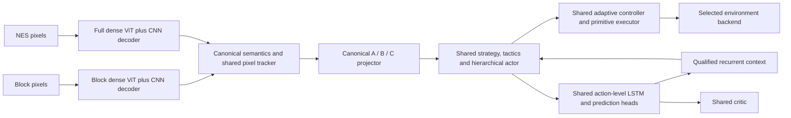

# Composable SMB implementation and restart

The compatible coaching repair and family-by-family audit are documented in
[canonical-smb-coaching.md](canonical-smb-coaching.md). This supersedes the initial
generic collector’s single-duration supervision and incomplete bridge goals.

Implementation date: 2026-09-08. Design: [composable SMB transfer plan](composable-smb-transfer-plan.md).

The [segmentation curriculum guide](smb-segmentation-curriculum.md) documents
creation/training of the recovered DeepLab teacher, its audited annotation role,
the separate CNN decoder inside each ViT, and the component swap contract.

## Architecture and interfaces

The implementations of the hierarchy, LSTM, critic, adaptive controller and
executor are shared. The dense ViTs have separate weights. Domain-specific ViT
embeddings never enter C: semantic probabilities supply deterministic spatial
features. A/B/C retain lengths 8/16/64; C contains position, canonical semantics,
support, 35 ordered physical features, eight availability indicators, three
fixed spatial features, enemy and platform velocity relative to Mario, fresh
measurement indicators, and estimate ages. The current scene encoder is `canonical_semantic_motion_v4`. Coordinates use a 256×240 viewport and common velocity
scales. The same local objective replaces simulator finish-marker distances.
Synthetic finish rectangles are hidden from canonical Block observations. A
leftward navigation request is an explicit task input for `retreat_recovery`.

`retroagi/core/smb_components.py` saves actor, world model, critic, executor and
auxiliary state separately, packages perception separately, and records semantic,
physical, feature-order and runtime contracts. Loads check contracts, architecture,
tensor layouts and checksums. Replacing a component invalidates gameplay
qualification. Parameter digests verify frozen components during adaptation.
The adaptive controller has no separate learned matrices; its learned parameter
producer belongs to the actor component. Callers must discard carried LSTM memory
when replacing components; assembling a bundle starts a fresh model.

`load_bundle()` accepts a compatible replacement perception checkpoint. The Full
policy loader also accepts a bundle directory containing a perceived runtime and
canonical ViT. Oracle bundles are diagnostic artifacts, not pixel-player bundles.

## Physics, observations and labels

`nes_land_v1` ports fixed-point acceleration, run/walk limits, braking, air
steering, variable jump forces and button edges. Jump and wait bins represent
physical frames: `1,2,4,6,8,10,12,14,16,18,20,22,24,26,28,32`. The new wait contract
supports a one-frame wait. Running holds B for right/right-jump in both engines.
The historical physics/profile and duration meanings remain available for
reproducing old checkpoints; they are not relabeled as compatible.

The new player body is 10×12. The Goomba damage body is 10×6, with a distinct floor
probe four pixels below it. Goomba/Koopa bounce speed is −4 pixels/frame. Landing
clears fractional vertical force. Simulator snapshots include the complete
fixed-point motion state. Pixel and NES geometry histories are included in
emulator snapshots; restoring an encoded frame does not advance tracking again.
The NES geometry observer handles the Goomba flattened state (`4`) as well as
falling defeated states, and emits a stomp event once per transition.

Two observation lanes remain explicit: collision instrumentation for labels and
diagnostics, and dense ViT plus a shared temporal tracker for pixel playback.
The tracker estimates camera motion and object velocity, marks unavailable motion
and patrol bounds in model inputs, and preserves static takeoff objectives in
world coordinates. Required stomps follow the observed enemy during flight;
relative enemy motion remains observable over scrolling, featureless floor. Emulator capture crops are padded back into physical coordinates,
not stretched. Pixel encoding has a regression test that fails on any RAM read.

The recovered six-class CNN is loaded offline by a maintained wrapper. Its
checkpoint is still `scripts/segmentation/MarioSegmentationModel.pth`. Its output
vocabulary lacks coin, goal and moving-platform classes. The real-clip preflight
measured collision IoU of approximately 0.331 for Mario, 0.934 for terrain and
0.186 for enemies; the body-edge test also failed. No CNN class was approved by
that audit. This measures agreement with collision labels, not human-annotated
sprite outlines. CNN proposals are therefore not silently accepted as truth.

Dense perception training uses separately recorded collision masks and rendered
pixels, with clip provenance and held-out splits. Full perception splits by
approach identity, avoiding adjacent-frame train/validation leakage. Perception
promotion requires per-class overlap, body-edge and missed-body gates; background
pixel accuracy is insufficient.

## Fresh training sequence

Entrypoint: `python -m scripts.smb_composable_training --config
scripts/configs/smb_composable_full_volume.json --output-dir <fresh-directory>`.
The configuration rejects resume/init checkpoints and fixed scenes, and requires
30 shared-policy epochs and all 20 independent generated families.

1. Recheck the paired motion traces. By default, generate fresh Block perception
   clips and train a dense ViT. With `--perception-checkpoint`, reuse qualified
   frozen vision and record its checksum/provenance instead. Policy weights are
   always fresh. See [sensorimotor repairs](smb-sensorimotor-repair.md).
2. Initialize one fresh shared core and start epoch 1. There is no policy
   bootstrap or independent per-family training phase.
3. Run 30 numbered epochs, each collecting 25 new layouts per family (500 total)
   and applying exactly 1,000 rehearsal updates. Collection and learning interleave
   in batches of up to three layouts per family; earlier epochs remain in replay.
   Status events include the epoch number, batch, stage, and update count. Family
   validation follows each epoch; low scores do not prevent the next epoch.
   Validation and test each contain 600 layouts. Final Block results gate emulator
   promotion after the shared run. Fixed scenes remain excluded.
4. Train ordered Block sequences with carried recurrent context and explicit
   episode resets. This is one-frame truncated BPTT at playback cadence. Verify
   that changing LSTM weights can change actor logits, and recheck family retention.
   Keep the reset-memory baseline if the recurrent candidate fails qualification.
5. Capture individual NES approaches and physical timing variations. Record
   snapshot, target, actions, physics fingerprint, collision labels and provenance.
   Deduplicate physical starts across splits. Save unresolved starts for repair.
   Teacher routes must reach stable support beyond the obstacle; deployed playback
   never searches snapshots or calls a teacher.
6. Audit the recovered DeepLab CNN on independent real collision labels and
   save `cnn_teacher_audit.json`. The automated pipeline does not retrain the CNN
   or use its proposals as labels; the documented teacher-training module covers
   that separate preparation work. Train and qualify the Full dense ViT and CNN
   decoder from instrumented labels. Train independent scratch controls for each approach,
   collect corrections on policy-visited training states, and test held-out nearby
   variations. The production schedule requests 18 training and 100 validation /
   100 test timing settings, subject to physical deduplication and reachability.
   At least 100 held-out evaluations and 99% success are required for a local gate.
7. Compare oracle/frozen core, Full ViT/frozen core, and Full ViT/adapted world model.
   World-model adaptation includes Block replay, frozen actor/critic hash checks
   and a Block retention evaluation. Save adapted components separately. Do not
   claim LSTM adaptation improves decisions if the recurrent path was not qualified.
8. Only after local gates pass, test longer uninterrupted playback and the named
   full-level starts, with actual completion and death signals. Local results never
   become a full-level qualification by themselves.

`manifest.json` records configuration and source hashes. `events.jsonl` and
`status.json` expose the active phase; a failed gate writes its reason and stops.
Epoch bundles and validation reports are separate. The intended fresh launch root
is `artifacts/smb_composable/full_volume_20260908/`, with training output in `run/`
and the process/log metadata beside it. No preflight weights are used to initialize
that run.

## Verification and limits

Preflight evidence is under `artifacts/full_smb/composable_implementation/`:

- All 13 flat-ground motion/button traces matched NES positions and contacts exactly.
- The terrain-only comparison covers two actual pipe approaches, each with wall,
  short-hold and long-hold traces. It stops at the captured terrain boundary or an
  enemy contact, so an unmodeled following section cannot corrupt the comparison.
  All six terrain traces passed: mount trajectories matched exactly, with at most
  one pixel of wall-position difference and no contact mismatches.
- All 63 sampled family/difficulty combinations had successful executor-verified
  routes. This is teacher feasibility, not model mastery.
- A fresh 32-wide core trained for 600 updates learned the `pit_leap` pilot and
  completed separate easy, medium and hard validation cases. This is a smoke test,
  not qualification of all 20 independent families.
- The first real-emulator capture produced 15 examples across three approaches;
  two timing variants required a longer solution and were recorded as unresolved.
  Subsequent production capture applies stricter safe-exit and deduplication gates.
- The complete frozen/oracle, frozen/pixel and adapted-world-model comparison
  path ran on real emulator starts with deliberately untrained smoke models; this
  verifies execution and reporting, not gameplay success.
- The initial 300-update perception smoke reduced its loss but failed the perception
  gate. Its weights are not used by the restart.
- The full test suite passed 770 tests before the final targeted additions; final
  regressions also passed all 62 affected checks, including the added body and
  explicit task-direction tests.

The physics profile is not a complete NES reimplementation. Water, climbing,
power-state transitions, exact enemy free-fall/shell behavior, block animation and
all moving-platform contacts remain outside the measured parity claim. The contact
report explicitly lists exclusions. Physics compatibility and a successful teacher
route are not substitutes for autonomous emulator validation. No existing checkpoint,
CNN, preflight model or newly assembled bundle is declared a reliable Full SMB player.

## Startup correction (2026-09-08)

The initial launch exited before its first perception optimizer update: PyTorch's
spatial CUDA NLL reduction rejected strict deterministic mode. Perception now
flattens pixels into class rows before cross entropy, preserving class weights,
ignored labels and the mathematical objective while using the deterministic CUDA
matrix reduction. CPU-reference loss/gradient comparisons, repeatability checks
and an actual strict-CUDA perception training/save test pass (17 affected tests
including component regressions). Determinism remains enabled.

Logs now include timestamps, source-layout generation progress, the transition
into perception training, and its first completed update. Unexpected exceptions
report `runtime_failed`; measured qualification failures report `gate_failed`.
The failed run is retained. The corrected fresh launch uses
`artifacts/smb_composable/full_volume_20260908_retry1/`; discover the latest PID,
run directory and log through `artifacts/smb_composable/active_run.json`.

## Collision-perception qualification repair (2026-09-08)

The CUDA-corrected launch completed 4,000 perception updates but failed the
collision-perception gate. Three measurable problems contributed:

- Weighted cross entropy assigned Mario/enemies 50 times the background weight,
  but inference interpreted its weighted scores as ordinary probabilities. The
  resulting foreground bias enlarged predicted bodies. Applying the analytical
  log-weight correction to the same checkpoint raised validation Mario IoU from
  0.810 to 0.935, enemy IoU from 0.824 to 0.903 and coin IoU from 0.749 to 0.904;
  body-edge p95 fell from four to 1.5 pixels. Training-scene results improved
  similarly, so this was not primarily validation-only overfitting.
- Unusual appearances were underrepresented in uniform frame sampling. Only 65
  of 4,758 training frames contained yellow, skidding Mario, whose color resembles
  coins. Defeated enemies remained visible but correctly had background collision
  labels. Larger development checks found missed skid frames and defeated-enemy
  false positives. Tiny viewport-edge bodies also required better coverage.
- Pixel-averaged loss and the patch decoder did not consistently enforce precise
  small-object overlap. Low average training loss was insufficient evidence of
  accurate collision geometry. Constant-rate 4,000-update experiments continued
  to miss the overlap requirements even after improving some other measurements.

The final trainer makes these changes:

1. Store training class weights in perception config and subtract their logarithms
   from inference logits before producing masks, positions, support and semantic
   tokens. Training keeps raw logits for weighted cross entropy.
2. Add a full-resolution residual decoder inside each domain-specific ViT: two
   3×3 convolution layers with 16 channels and a seven-class output layer. It
   combines RGB pixels with contextual patch logits and trains jointly with the
   ViT. This is a learned decoder, not a color lookup or RAM observation path.
3. Translate training images and collision masks together by up to 128 pixels
   horizontally and 64 vertically, without rescaling or wrapping. Newly introduced
   pixels use ignore label 255. Physical policy trajectories are unchanged.
4. Record source appearance tags during clip capture and sample uniformly across
   the observed normal/skidding/defeated-enemy combinations. Tags only choose
   training examples; they never enter inference. Untagged clips retain uniform
   frame sampling. Validation/test visit each original frame once.
5. Add a foreground overlap loss (weight 0.5), calculated per image and class, so
   errors on small bodies cannot disappear into background/terrain pixel counts.
   Use 8,000 perception updates with cosine learning-rate decay from 0.0003 to
   0.00003. The shared-policy schedule remains 30 epochs.

All component interfaces, hierarchy, LSTM and adaptive-controller implementations
are unchanged. Old perception checkpoints without the new config fields retain
historical inference behavior. New checkpoints persist the correction and decoder
architecture. Live logs now expose perception validation metrics and qualification.

A fresh production-size run passed the original validation requirements. A final
untouched test used 252 layouts (test indices 12–23) disjoint from training,
validation, and the earlier 252-layout development check:

| Metric | Validation: 1,201 frames | Test: 4,642 frames | Requirement |
| --- | ---: | ---: | ---: |
| Mario IoU | 99.75% | 99.65% | ≥90% |
| Terrain IoU | 99.96% | 99.96% | ≥90% |
| Coin IoU | 97.59% | 97.70% | ≥90% |
| Enemy IoU | 98.20% | 98.27% | ≥90% |
| Moving-platform IoU | 99.13% | 99.51% | ≥90% |
| Body-edge error, p95 | 1 pixel | 1 pixel | ≤2 pixels |
| Missed bodies | 0 | 0 | 0 |

No requirement was relaxed. Goals are absent from these Block collision labels
because synthetic finish markers are hidden. The earlier development set also
passed all requirements after the final change (4,743 frames, zero misses).
Evidence: `artifacts/smb_composable/perception_final_fix_20260908/`, including
`model/metrics.json`, `development_metrics.json` and `heldout_metrics.json`.
All 27 affected regression tests passed, including strict CUDA updates, analytical
score correction, old/new checkpoint loading, decoder gradients, ignored pixels,
translation alignment, and sampling of rare appearances.

The corrected full pipeline is restarted from fresh weights in
`artifacts/smb_composable/full_volume_20260908_retry2/`. The latest process/log
metadata is `artifacts/smb_composable/active_run.json`. This qualifies Block
collision perception on the measured splits; it does not qualify all policy
families or Full SMB perception/playback in advance.

## Numbered epochs only (2026-09-09)

The separate 180-layout-per-family, 10,000-update bootstrap stage has been removed
at the user's request. Its configuration keys are rejected. Perception still
trains from scratch, then one fresh shared core begins epoch 1 immediately.
All policy collection, coaching, replay, and the 30,000 total policy updates
belong to the 30 numbered epochs. No bootstrap updates are added or relabeled
as an extra epoch. Independent family-model prerequisites remain removed.

`full_volume_epoch` events identify collection, optimization, and validation;
collection progress also carries the current epoch. `full_volume` records the
completed epoch's loss and autonomous family results. The latest process/log
metadata is `artifacts/smb_composable/active_run.json`.

## Stomp timing and scrolling repair (2026-09-09)

The [stomp repair audit](smb-stomp-scrolling-repair.md) covers unsafe hold predictions,
coaching at policy and nearby takeoff states, recovery with forward momentum,
and camera-independent enemy motion. These examples are collected inside the
existing numbered epochs. The full-volume schedule is still 30 epochs with
1,000 policy updates per epoch; no bootstrap or prerequisite family run is added.
Vision can be reused, while policy observations and replay use the version 3
contract and must be regenerated for a fresh full-volume run.
