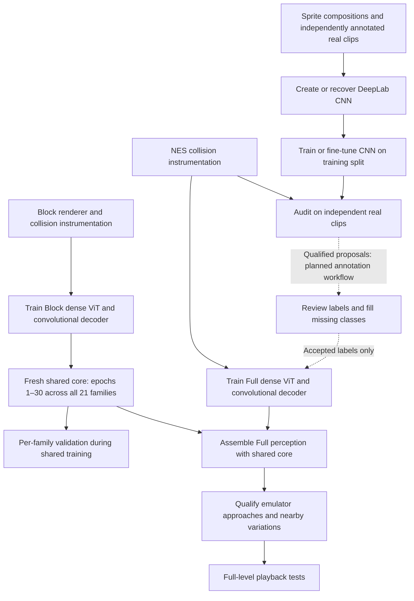
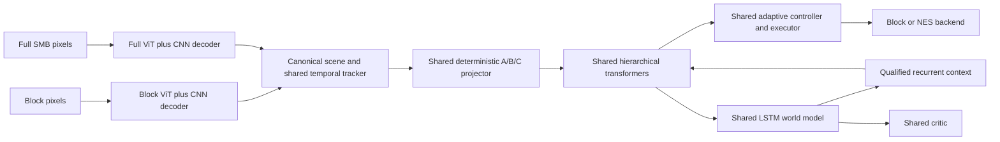

# Segmentation networks and composable SMB curriculum

This guide describes the CNN's creation, training, qualification and use in the
Block SMB → Full SMB curriculum. It complements the [transfer plan](composable-smb-transfer-plan.md)
and [implementation report](composable-smb-implementation.md).

## Two CNN roles

| Network | What it learns | Where it is used | Current status |
| --- | --- | --- | --- |
| DeepLabV3 with a ResNet50 backbone | Six-class Full SMB image segmentation | Offline teacher that can propose annotations for training Full SMB perception | Recovered checkpoint and maintained inference/audit code exist; latest recorded collision audit failed |
| Convolutional decoder inside `DenseSMBPerception` | Fine collision boundaries from RGB pixels and ViT patch predictions | Part of each domain's deployed perception component | Trained jointly with the Block or Full ViT; included in its checkpoint |

The small decoder is not the recovered DeepLab network. Training it does not
retrain DeepLab. The shared hierarchy, LSTM and adaptive controller are separate
from both perception networks.

## Where segmentation belongs in the curriculum



The solid NES-to-Full-ViT path is implemented. In
[`smb_composable_training.py`](../scripts/smb_composable_training.py), emulator
capture produces real RGB frames and independent collision labels. The pipeline
audits the existing CNN on validation clips, then trains Full perception directly
from the recorded collision labels. It does **not** automatically create/retrain
DeepLab or insert its predicted masks into the training data. CNN creation and
retraining below are an explicit offline preparation module; automatic retraining
and ingestion of reviewed proposals remain work to implement.

This distinction matters because the existing CNN has not passed the collision
qualification. The latest recorded preflight measured about 33.1% Mario IoU,
93.4% terrain IoU and 18.6% enemy IoU, and failed the body-edge requirement. No
class was approved by that audit. These numbers measure agreement with physical
collision bodies, not human-annotated sprite outlines. The CNN can be useful for
annotation assistance without being accurate enough to define collisions.

## 1. Create or recover the CNN

The recovered network is available at
[`scripts/segmentation/MarioSegmentationModel.pth`](../scripts/segmentation/MarioSegmentationModel.pth).
It is a real state dictionary, 168,362,296 bytes, with SHA-256
`fdd812476c8715e97b39ca9060a3dc90b015966db17b3d9729e6b27f0da5be62`.
Recovery from an older revision is unnecessary.

Use the maintained
[`LegacyCNNSegmentationTeacher`](../retroagi/stages/full_smb/segmentation_teacher.py)
to inspect or generate proposals from it. This loader constructs DeepLabV3/ResNet50
with a six-class `DeepLabHead(2048, 6)`, detects whether the saved state includes
an auxiliary classifier, and loads strictly. It requests neither segmentation
nor backbone downloads. Inputs use RGB values scaled to [0, 1], matching the
legacy `ToTensor()` preprocessing; do not silently add ImageNet normalization.

A new six-class teacher can be constructed independently of the policy:

```python
from torchvision.models.segmentation import deeplabv3_resnet50
from torchvision.models.segmentation.deeplabv3 import DeepLabHead

cnn = deeplabv3_resnet50(weights=None, weights_backbone=None, aux_loss=False)
cnn.classifier = DeepLabHead(2048, 6)
```

This creates random weights. It does not reproduce the recovered checkpoint.
For fine-tuning that checkpoint instead, take `.model` from the maintained
teacher wrapper and explicitly call `requires_grad_(True).train()`; the wrapper
initially freezes it for inference. Retain its saved architecture when exporting.
Record any alternative pretrained initialization and its preprocessing explicitly.

The six native classes map as follows:

| CNN ID | CNN meaning | Canonical policy class |
| ---: | --- | --- |
| 0 | Background/default | 0: background |
| 1 | Floor, including legacy solid-terrain labels | 2: platform |
| 2 | Brick | 2: platform |
| 3 | Box | 2: platform |
| 4 | Enemy | 5: enemy |
| 5 | Mario | 1: mario |

Canonical coin (3), goal (4) and moving-platform (6) classes are unsupported.
[`canonical_vision(..., "legacy_cnn")`](../retroagi/core/smb_scene.py) sums
probabilities for classes that merge; it does not invent the missing categories.
A background prediction cannot be used to certify that an unsupported object is
absent. A future seven-class CNN requires a new head, labels, loader and renewed
qualification; changing class names in metadata is insufficient.

## 2. Build the CNN training data

The historical generator and trainer are in
[`segment_training.py`](../scripts/segmentation/segment_training.py). They compose
sprites and terrain into RGB scenes and six-class integer masks. Expected local
inputs include tilesets, extracted sprites, enemy/Mario sprite files and
`label_assignment/sprite_labels_correspondence.csv`, under its `dataset_generator`
root. Those source assets are not all checked in. The script runs extraction,
generation, training and plotting at top level, so it is a reference implementation,
not a supported command to import or run against the current training directory.

For a maintained teacher-training exercise:

1. Produce paired RGB images and integer masks with IDs 0–5; reserve 255 for
   unknown/ignored pixels. Record whether each mask describes **visible sprites**
   or **physical collision bodies**. Keep those targets distinct.
2. Bootstrap with sprite compositions, then add independently annotated actual
   emulator clips. Include animation frames, supported power states, camera
   positions, partly visible bodies and defeated enemies. Collision labels must
   reflect whether an enemy is still a hazard, not merely whether its sprite exists.
3. Reserve train, validation and test clips by approach/trajectory identity before
   fitting. Adjacent frames from one trajectory cannot appear on opposite sides
   of the split. Track source assets, seeds, clip identities and annotation edits.
4. Apply crops, translations or flips to image and mask together. Preserve class
   IDs with nearest-neighbor mask operations. For collision supervision, preserve
   the 256×240 coordinate system and body edges; do not stretch captures to fit.
5. Balance rare appearances and small bodies. Keep validation/test at their
   declared distribution. Fill unsupported classes from independent labels or
   mark them unknown; do not turn missing teacher knowledge into background truth.

The canonical seven-class collision masks are **not** native six-class CNN
labels: for example, canonical Mario ID 1 means floor to the old CNN. Nor can a
canonical terrain mask recover the old floor/brick/box distinctions. Use an
explicit, documented label conversion and ignore unsupported regions, or supply
native annotations; never feed these datasets interchangeably by shape alone.

## 3. Train, validate and save the CNN

The reference script's defaults are 1,000 generated images, an 80/20 image split,
224×224 random training crops with horizontal flips, center-cropped validation,
batch size 4, 45 epochs, and cross entropy with ignore ID 255. It initializes from
pretrained DeepLab weights and uses SGD at 0.001, momentum 0.9, weight decay 0.0001,
with learning-rate drops at epochs 37 and 42. It saves the final epoch's state.
These are reference-code defaults, not a verified training manifest for the
recovered checkpoint, and not the present dense-ViT schedule.

A maintained training loop should train the six-class output on the training
split, evaluate held-out per-class IoU and body errors, and select a checkpoint
using validation results. Use the test split only after selection. One loss/update
fragment, with a prepared RGB batch and native six-class masks, is:

```python
import torch.nn.functional as F

cnn.train()
logits = cnn(images)["out"]  # images: float [B, 3, H, W], RGB in [0, 1]
loss = F.cross_entropy(
    logits.movedim(1, -1).reshape(-1, 6),
    masks.long().reshape(-1),  # [B, H, W], native IDs 0..5 or 255
    ignore_index=255,
)
optimizer.zero_grad(set_to_none=True)
loss.backward()
optimizer.step()
```

This is a recipe fragment, not an additional training CLI; it requires dataloaders,
an optimizer, evaluation and checkpoint selection. Flattening pixels avoids the
spatial CUDA NLL reduction that rejects strict determinism in the installed
PyTorch environment. DeepLab's training batch-normalization path also needs more
than one example for its pooled features; the historical batch size is four.

Save the selected CPU state dictionary under a **new** checkpoint path, plus a
sidecar manifest containing architecture, class order, preprocessing, initialization,
label target, splits, seed, optimizer/schedule, checkpoint hash and validation/test
metrics. Preserve the recovered checkpoint for comparison. If training uses class
weights, define and test how weighted scores become inference probabilities; the
legacy wrapper does not automatically apply the dense ViT's score correction.

## 4. Qualify the teacher and use its output

A runnable inference example, supplied with an actual RGB frame, is:

```python
from retroagi.stages.full_smb.segmentation_teacher import LegacyCNNSegmentationTeacher
from retroagi.core.smb_scene import canonical_vision

teacher = LegacyCNNSegmentationTeacher(device="cpu")
# frame is an RGB HWC array from an emulator capture.
native = teacher.encode(frame)
proposal = canonical_vision(native, "legacy_cnn")
```

For a newly trained six-class state, pass `checkpoint="path/to/new_teacher.pth"`.
The output remains a proposal. Compare it with independent annotations; record
missed bodies, edge errors, per-class IoU, animation/appearance failures and temporal
stability. High average pixel accuracy or confidence does not establish coverage.

[`audit_teacher(clips, output, device=...)`](../scripts/smb_teacher_audit.py) is the
current collision-audit function. It expects clip records with `file`, `frames`
and `label_source="nes_collision_instrumentation"`; each NPZ contains RGB `images`
and canonical collision `labels`. It audits the default recovered checkpoint and
writes per-class overlap, body-edge/miss metrics and `qualified_classes`. It has
no standalone argument-parsing CLI or checkpoint override. To audit a different
teacher, use the maintained loader above with `evaluate_perception`/`ClipDataset`
and the same canonical mapping, or implement an explicit audit entrypoint.

Once a teacher passes the relevant checks, the planned label-building workflow is:
run it on training clips, review/correct proposals, supply unsupported classes
from independent labels, and store accepted masks with teacher hash, target type
and correction provenance. Train the Full ViT on those accepted labels. This is
supervision transfer: CNN weights are not copied into the ViT. Unreviewed sprite
masks do not replace collision labels. The current automatic curriculum continues
to use direct instrumentation labels while this proposal-ingestion path is absent.

## 5. Train the deployable perception components

[`DenseSMBPerception`](../retroagi/core/smb_perception.py) contains a patch ViT and,
in the production configuration, the 16-channel convolutional refinement decoder.
[`train_perception`](../scripts/smb_perception_training.py) trains them jointly
from scratch, separately for Block and Full SMB. Each emits the same seven-class
collision interface. The production schedule uses 8,000 updates, cosine learning-
rate decay, class-weight correction, foreground-overlap loss and aligned spatial
augmentation. Source appearance tags balance the Block batches; untagged Full
clips use uniform frame sampling. The CNN decoder needs no separate checkpoint.

Qualification requires at least 90% IoU for observed foreground classes, body-edge
p95 at most two pixels, and zero reported missed bodies. Full perception must
pass its own real-frame checks; Block perception results do not qualify it.
At playback, pixels pass through the selected dense ViT/decoder and the shared
tracker. DeepLab and RAM label generation are not in that pixel-policy path.

## 6. What makes the model composable



| Component | Initial Block → Full transfer | Permitted later change |
| --- | --- | --- |
| DeepLab annotation teacher | Offline data preparation; outside the player bundle | Retrain and re-audit without changing the player core |
| Dense ViT plus CNN decoder | Swap the whole perception checkpoint for the Full version | Train domain-specific weights behind the same scene interface |
| Scene tracker and projector | Shared implementation and feature meanings | Version any interface change and revalidate both stages |
| Hierarchical actor/strategy/tactics | Same implementation and initially identical weights | Fine-tuning is a separately tested fallback |
| Adaptive controller and executor | Same operation, primitive meanings and timing | Keep both engines' contracts synchronized |
| LSTM world model and outcome heads | Same implementation and initially copied weights | Adapt on NES sequences with Block replay; verify actor/critic stay frozen |
| Critic | Initially copied shared implementation and weights | Requalify after world-model changes; any retraining is explicit |

The adaptive controller applies generated weights/biases; it has no independent
learned matrix checkpoint. Its learned parameter-producing networks belong to
the actor partition. LSTM adaptation changes weights, not architecture. It can
change greedy decisions through carried recurrent context only when that path
has been trained and qualified in both domains; better predictions alone do not
prove better control.

Compatibility means more than tensor dimensions. `SMBComponentContract` records
`smb_scene_v2`, the seven semantic classes, A/B/C lengths 8/16/64, 35 physical
features, eight availability indicators, a 256×240 viewport, velocity scales,
`nes_land_v1`, frame skip 1, physical jump/wait units, and recurrent/reset semantics.
The projector uses deterministic semantic spatial features. Independently trained
ViT latent embeddings never cross the policy boundary.

[`smb_components.py`](../retroagi/core/smb_components.py) provides `export_bundle`,
`load_bundle`, `load_component`, `trainable_components` and
`verify_frozen_components`. Bundles store perception, actor, world model, critic,
executor settings and auxiliary heads separately, with contracts and checksums.
For example, with qualified artifacts already available:

```python
from retroagi.core.smb_components import load_bundle

core, full_vision, manifest = load_bundle(
    "path/to/qualified_block_bundle",
    perception_path="path/to/qualified_full_perception.pth",
    device="cpu",
)
```

This assembles the core with replacement perception; it does not itself attach an
emulator or prove gameplay. The loader currently accepts `DenseSMBPerception`
checkpoints, not arbitrary CNN files. A direct DeepLab player would need a canonical
adapter, missing-class coverage and bundle-loader support, plus fresh qualification.

Changing a component invalidates gameplay qualification. Reset executor/tracker
history and discard carried LSTM state when assembling a new runtime. Keep the
actor/controller frozen for the initial Full comparison, separately test LSTM
adaptation and Block retention, then qualify local emulator approaches and nearby
variations before full-level playback. The independent perception networks make
the visual swap possible; physics and execution parity make the reused core's
predictions and actions meaningful in both environments.
